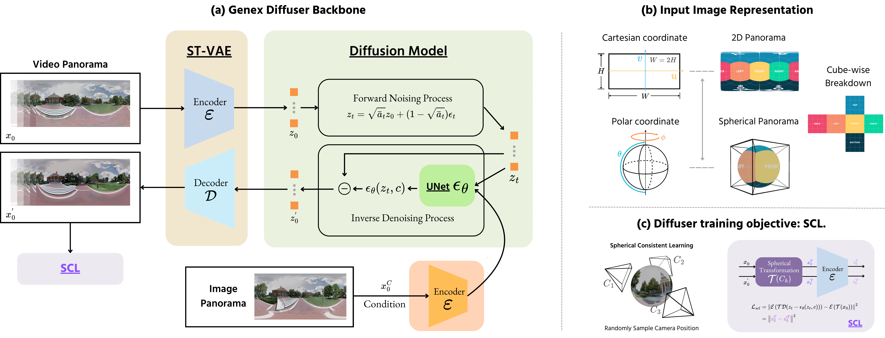
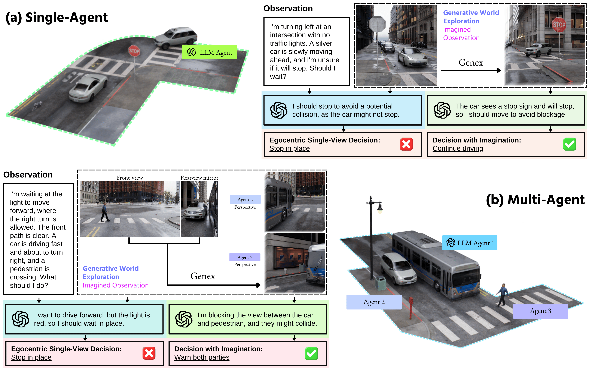

<p align="center">
    
</p>
<div align="center">
    <a href="https://generative-world-explorer.github.io"></a>
    <a href="https://www.youtube.com/watch?v=cf4apIcnPtU" target="_blank"></a>
    <a href="https://arxiv.org/abs/2411.11844"></a>
    <a href="https://arxiv.org/pdf/2411.11844"></a>
    <a href="https://huggingface.co/papers/2411.11844"></a>
    <a href="https://github.com/Beckschen/genex" target="_blank"></a>
</div>


## Generative Wolrd Explorer
Planning with partial observation is a key challenge in embodied AI. While prior works rely on physical exploration to update beliefs about the world, humans mentally imagine unseen parts to make informed decisions without constant physical exploration. To emulate this, we introduce **Generative World Explorer (Genex)**, an egocentric framework enabling agents to mentally explore large-scale 3D worlds (e.g., urban scenes) and update their beliefs using imagined observations. Trained on a synthetic dataset, **Genex-DB**, Genex generates high-quality observations over long horizons, improving decision-making for models like LLM agents by providing updated beliefs.


- [Generative Wolrd Explorer](#generative-wolrd-explorer)
- [Genex](#genex)
  - [Architecture](#architecture)
  - [Exploration](#exploration)
  - [Embodied AI](#embodied-ai)
  - [Interactive Demo](#interactive-demo)
- [Code Usage](#code-usage)
- [BibTeX](#bibtex)


## Genex

**Generative World Explorer (Genex)** introduces a novel approach for planning with partial observation in embodied AI. Unlike traditional methods requiring physical exploration to update beliefs about the world, Genex enables agents to perform **mental exploration** of large-scale 3D environments (e.g., urban scenes) through video generation. This capability allows agents to imagine unseen parts of the world and make informed decisions without prior physical exploration.


- **Video Generation**: Genex employs a video generation model to create realistic 360-degree panoramic video sequences simulating forward movement.
- **Exploration Consistency**: Ensures navigational cycle consistency by generating consistent views when returning to the origin.
- **Embodied AI Integration**: Supports applications in robotics, autonomous vehicles, and virtual environments.

### Architecture



Genex's architecture is based on a modified video generation model that transforms input panoramic images into realistic video sequences, leveraging **image-to-video diffusion models**. These models ensure spherical consistency during navigation and maintain visual realism across frames.

### Exploration


Genex integrates with multimodal LLMs like GPT-4 to support agent navigation in imaginative worlds. The agent performs actions such as forward movement and directional changes, seamlessly adapting to unseen environments through panoramic video generation.

### Embodied AI



**Genex gives a new level of intelligence to embodied AI agents.**
For a single-agent scenario involving decision-making, picture yourself driving down a street when a siren
sounds, but you can’t see the source. With Genex, you project what’s ahead. It reveals an ambulance just
around the corner. You stop crossing the street to make space for it to pass.
For a multi-agent scenario involving interaction, suppose you are waiting at a red light. You see a
pedestrian and an approaching car, and everything seems fine. But Genex helps you recognize that the
pedestrian can’t see the car. Likewise, the car can’t see the pedestrian. Your vehicle is blocking their
views. Realizing this, you act immediately to warn them, preventing a collision.

### Interactive Demo

Try the [interactive demo](https://generative-world-explorer.github.io/#interactive_demo) to explore Genex's capabilities. [To be completed]


## Code Usage
To be released

## BibTeX

```bibtex
@misc{lu2024generativeworldexplorer,
  title={Generative World Explorer}, 
  author={Taiming Lu and Tianmin Shu and Alan Yuille and Daniel Khashabi and Jieneng Chen},
  year={2024},
  eprint={2411.11844},
  archivePrefix={arXiv},
  primaryClass={cs.CV},
  url={https://arxiv.org/abs/2411.11844}, 
}
