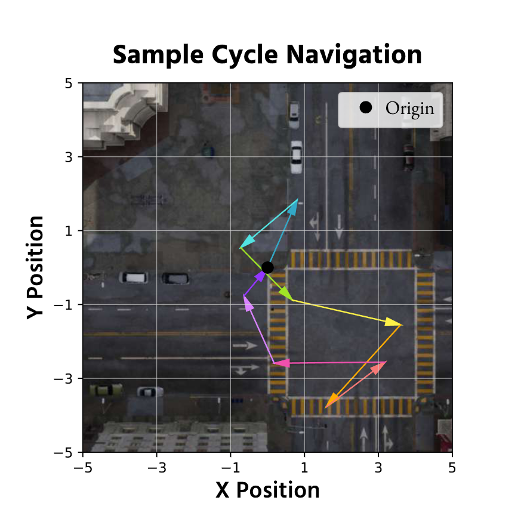

# IECC: Imaginative Exploration Cycle Consistency

## Overview
This tool evaluates the IECC (Imaginative Exploration Cycle Consistency) metric introduced in the GenEx paper. IECC quantifies the coherence of virtual environment exploration by measuring how well a model returns to its starting point after completing a closed loop path.

For any randomly sampled circular path, we calculate the latent MSE between the initial image and the final generated image using Inception-v4 encodings.



## Step 1: Prepare Input Data
Organize your input data with the following structure:
```
main_folder/
├── subfolder1/
│   └── original.png
├── subfolder2/
│   └── original.png
...
```

## Step 2: Generate Explorations
Run the consistency test script:
```
python iecc_generate.py --unet_path <PATH_TO_UNET> --svd_path <PATH_TO_SVD> --navigation_distances <DISTANCES> --rotation_times <ROTATIONS> --num_data <NUM_SAMPLES>
```

Example:
```
python consistency.py --unet_path "./models/unet" --svd_path "genex-world/GenEx-World-Explorer" --navigation_distances 20 40 --rotation_times 3 4 --num_data 500
```

## Step 3: Evaluate Results
After generation completes, your folders will contain:
```
main_folder/
├── subfolder1/
│   ├── navigated.png   # Final image after circular path
│   └── original.png    # Starting image
├── subfolder2/
│   ├── navigated.png
│   └── original.png
...
```

Calculate the IECC score:
```
python iecc_score.py main_folder
```

Lower scores indicate better consistency - the model returns closer to the starting point after completing the path.

## Requirements

```
torch>=1.10.0
torchvision>=0.11.0
numpy>=1.20.0
Pillow>=8.0.0
opencv-python>=4.5.0
tqdm>=4.50.0
matplotlib>=3.3.0
timm>=0.6.0
diffusers>=0.33.1
transformers>=4.20.0
argparse>=1.4.0
```