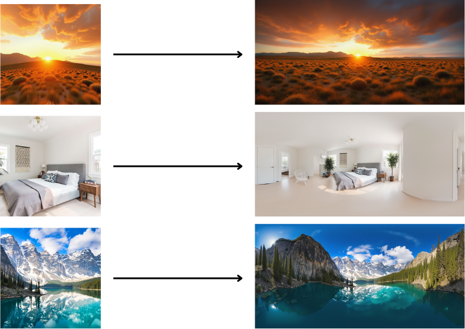
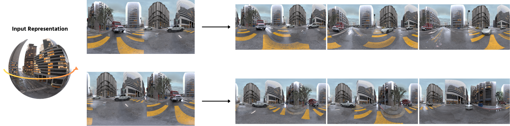

# GenEx: World Generation & Exploration 🌍

## Table of Contents
- [GenEx: World Generation \& Exploration 🌍](#genex-world-generation--exploration-)
  - [Table of Contents](#table-of-contents)
  - [Introduction](#introduction)
- [GenEx-World-Initializer 🧭🌍](#genex-world-initializer-)
  - [📦 Usage](#-usage)
  - [🏁 Mask](#-mask)
  - [🔧 Requirements](#-requirements)
- [GenEx-World-Explorer 🚀🌍](#genex-world-explorer-)
  - [🏃🏻‍♂️‍➡️ Explorer class](#️️-explorer-class)
  - [📦 Usage](#-usage-1)
    - [Generate forward movement](#generate-forward-movement)
    - [Change the navigation direction](#change-the-navigation-direction)
    - [Save current exploration](#save-current-exploration)
  - [🌟 Advanced Features](#-advanced-features)
    - [Cubemap Conversions](#cubemap-conversions)
    - [Normal View Extraction](#normal-view-extraction)
  - [🔧 Requirements](#-requirements-1)
- [Complete Workflow: From Image to Explorable World](#complete-workflow-from-image-to-explorable-world)

## Introduction

GenEx is a two-stage pipeline for creating and exploring immersive virtual environments. The system consists of two complementary components:

1. **GenEx World Initializer** - Converts a single perspective image into a complete 360° panoramic environment
2. **GenEx World Explorer** - Enables dynamic navigation and exploration of the generated panoramic environment

Together, these components allow you to create and explore fully realized virtual worlds from a single image input.

# GenEx-World-Initializer 🧭🌍

**GenEx World Initializer** is panorama generation pipeline built on top of the [FluxFillPipeline](https://huggingface.co/black-forest-labs/FLUX.1-Fill-dev).

It transforms a **single view image** into a **360° panoramic image** using vision-conditioned inpainting.

- 🖼️ Input: One perspective image (any size, will be center-cropped to square)
- 🧠 Prompt: Optional text to guide panoramic generation
- 🎯 Output: 2048 × 1024 equirectangular image
- 🧩 Mask: Uses a fixed panoramic mask



## 📦 Usage

```python
from initializer import GenExWorldInitializerPipeline
from PIL import Image
import torch

model_id = "genex-world/World-Initializer-image-to-panorama"  # Or use the actual path on disk

pipe = GenExWorldInitializerPipeline.from_pretrained(
    model_id,
    torch_dtype=torch.bfloat16,
).to("cuda")

# Load your image (any resolution)
image = Image.open("perspective_example.png")

# Run inference
front_view, output = pipe(image=image)
output.images[0]
```

## 🏁 Mask
The following mask is used to train the inpainting diffuser and used to inference automatically.


## 🔧 Requirements

```txt
diffusers>=0.33.1
transformers
numpy
pillow
sentencepiece 
```

# GenEx-World-Explorer 🚀🌍

**GenEx World Explorer** is a video generation pipeline built on top of [Stable Video Diffusion (SVD)](https://huggingface.co/stabilityai/stable-video-diffusion-img2vid-xt-1-1).
It takes a keyframe, and generates a temporally consistent video. This explorer version builds on SVD with a custom `UNetSpatioTemporalConditionModel`.

The diffuser generate a forward moving path of a panoramic input image, to explore a given scene.



## 🏃🏻‍♂️‍➡️ Explorer class

The `Explorer` class provides a comprehensive toolkit for navigating and manipulating panoramic environments through video generation. It allows you to:

- Generate smooth forward movements through scenes
- Rotate panoramic images programmatically
- Convert between equirectangular and cubemap representations
- Extract normal rectilinear views from panoramas
- Navigate custom paths through virtual environments
- Export the generated explorations as videos or GIFs

This class is the core component of GenEx, enabling dynamic exploration of generated worlds with frame-by-frame control and manipulation.

## 📦 Usage

```python
from explorer import Explorer
from diffusers import UNetSpatioTemporalConditionModel, StableVideoDiffusionPipeline
import torch
from PIL import Image

# Initialize the Explorer
explorer = Explorer()

# Load your model paths
model_id = "genex-world/GenEx-World-Explorer" # Or use the actual path on disk

# Initialize the pipeline
pipe = explorer.get_pipeline(
    unet_path=model_id,
    svd_path=model_id,
    num_frames=25,
    fps=7,
    image_width=1024,
    image_height=512
)

# Load starting panoramic image
start_image = Image.open("panorama_example.png")
explorer.set_current_image(start_image)
```

The following operations can be done in a loop:
### Generate forward movement
```python
frames = explorer.move_forward(
    num_frames=25,
    num_inference_steps=30,
    noise_aug_strength=0.02
)
```
### Change the navigation direction
```python
# Rotate the panorama
rotated_image = explorer.rotate_panorama(rotation_degrees=45)
```
### Save current exploration
```python
# Save the exploration as video
explorer.save_video("exploration.mp4", fps=10)

# Save as GIF
explorer.save_gif("exploration.gif", fps=7)
```

## 🌟 Advanced Features

### Cubemap Conversions

Convert between equirectangular panoramas and cubemaps for specialized view manipulations:

```python
# Convert panorama to cubemap
cubemap, faces = explorer.convert_panorama_to_cubemap(
    panorama_image=start_image,
    interpolation=True,
    scale_factor=2
)

# Convert cubemap back to equirectangular panorama
equirect = explorer.cubemap_to_equirectangular(
    cubemap_faces=faces,
    output_width=1024,
    output_height=512
)
```

### Normal View Extraction

Extract rectilinear views from panoramas with precise control over field of view and orientation:

```python
normal_view = explorer.extract_normal_view(
    panorama=start_image,
    fov_h=90,
    fov_v=60,
    center_yaw=0,
    center_pitch=0,
    center_roll=0,
    output_width=800,
    output_height=600
)
```

## 🔧 Requirements

```
diffusers>=0.33.1
transformers
torch>=2.0.0
numpy
pillow
opencv-python
imageio
imageio[ffmpeg]
tqdm
```

# Complete Workflow: From Image to Explorable World

```python
import torch
from PIL import Image
from initializer import GenExWorldInitializerPipeline
from explorer import Explorer

# Step 1: Load both models
initializer = GenExWorldInitializerPipeline.from_pretrained(
    "genex-world/World-Initializer-image-to-panorama",
    torch_dtype=torch.float16,
).to("cuda")

explorer = Explorer()
explorer.get_pipeline(
    unet_path="genex-world/GenEx-World-Explorer",
    svd_path="genex-world/GenEx-World-Explorer",
    num_frames=25,
    fps=7,
    image_width=1024,
    image_height=512
)

# Step 2: Generate panorama from perspective image
perspective_image = Image.open("input_image.jpg")
front_view, output = initializer(image=perspective_image)
panorama = output.images[0]
panorama.save("generated_panorama.png")

# Step 3: Explore the generated panorama
explorer.set_current_image(panorama)

# Generate forward movement
frames = explorer.move_forward(
    num_frames=25,
    num_inference_steps=30,
    noise_aug_strength=0.02
)

# Change direction and continue exploring
explorer.rotate_panorama(rotation_degrees=30)
frames = explorer.move_forward(
    num_frames=15,
    num_inference_steps=30
)

# Save the exploration
explorer.save_video("exploration.mp4", fps=10)
explorer.save_gif("exploration.gif", fps=7)
```
